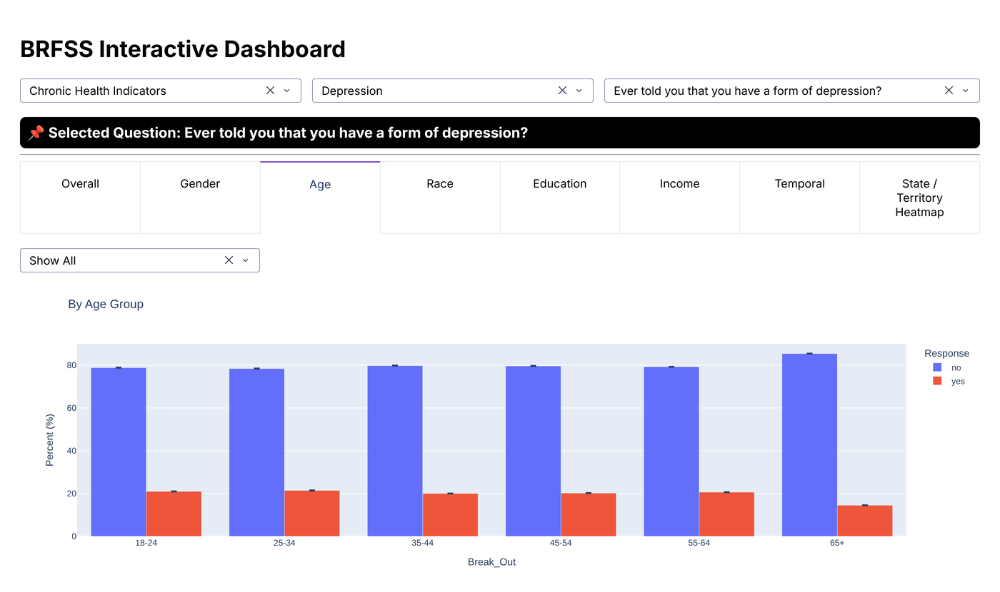

# BRFSS Interactive Dashboard (2011–present)

An interactive Plotly Dash app for exploring the CDC's **Behavioral Risk Factor Surveillance System**
(BRFSS) prevalence data. Pick any survey question, then see how responses break down by gender, age,
race, education, income, year and state, with confidence intervals on every estimate.

<p align="center"></p>
<p align="center"><sub>"Ever told you that you have a form of depression?" by age group, from the full 2011–present CDC file.</sub></p>

## What it does

- **Question picker:** a three-level cascade of Class → Topic → Question (for example, Chronic Health Indicators → Depression).
- **Eight panels:** Overall, Gender, Age, Race, Education, Income, a year-by-year trend, and a state/territory map. A panel with no data for the chosen question says so instead of drawing an empty chart.
- **Confidence intervals:** every bar carries ±2 standard-error whiskers, roughly a 95% interval.
- **Top / bottom 3:** each panel can be narrowed to the three highest or lowest groups.

## How the numbers are computed

BRFSS publishes a prevalence percentage and a sample size per state, year and breakout group, not raw
responses. To pool states into one estimate, each panel:

1. Drops the national rows (`US`, `UW`) so states aren't double-counted.
2. Rebuilds each row's denominator from `Sample_Size × 100 / Data_value`.
3. Pools respondents and denominators across states, so `percent = Σ respondents / Σ denominators`.
4. Computes `SE = √(p(100 − p) / n)` and plots `p ± 2·SE`.

First, `utils/merges.py` maps older and alternative response and breakout codes onto one set (for
example, income brackets refined over the years), so a group means the same thing in every year.

## Run it

1. Download the [BRFSS prevalence CSV from the CDC](https://data.cdc.gov/api/views/dttw-5yxu/rows.csv?accessType=DOWNLOAD). It's about 1 GB.
2. Save it, keeping the CDC filename, at:

   ```text
   data/raw/Behavioral_Risk_Factor_Surveillance_System__BRFSS__Prevalence_Data__2011_to_present_.csv
   ```

3. Install and start:

   ```bash
   python -m pip install pandas numpy dash plotly
   python app.py
   ```

4. Open [http://127.0.0.1:8050](http://127.0.0.1:8050). Loading the full CSV takes a while at startup; about 35 seconds in my last run.

Last run on Dash 4.4, pandas 3.0 and Plotly 7.1. The app resolves the CSV path relative to `app.py`,
and if the file is missing, startup says where it expected it. Raw CSVs are git-ignored.

See the [CDC dataset page](https://data.cdc.gov/Behavioral-Risk-Factors/Behavioral-Risk-Factor-Surveillance-System-BRFSS-P/dttw-5yxu)
for the column definitions.

## Structure

| Path | What it does |
|---|---|
| `app.py` | Layout, the question cascade, and one callback per panel |
| `utils/options.py` | Class, topic and question choices |
| `utils/prepare.py` | Filters to one question and applies the merges |
| `utils/merges.py` | Harmonises response and breakout IDs across years |
| `utils/aggregation.py` | Pooled prevalence and confidence intervals per panel |
| `assets/style.css` | Dashboard styling |
| `BRFSS_Dashboard_Workflow_Notebook.ipynb` | Design rationale and workflow |
| `BRFSS_Dashboard_Slides.pptx` | Presentation |

## Stack

Python · pandas · NumPy · Plotly Dash
