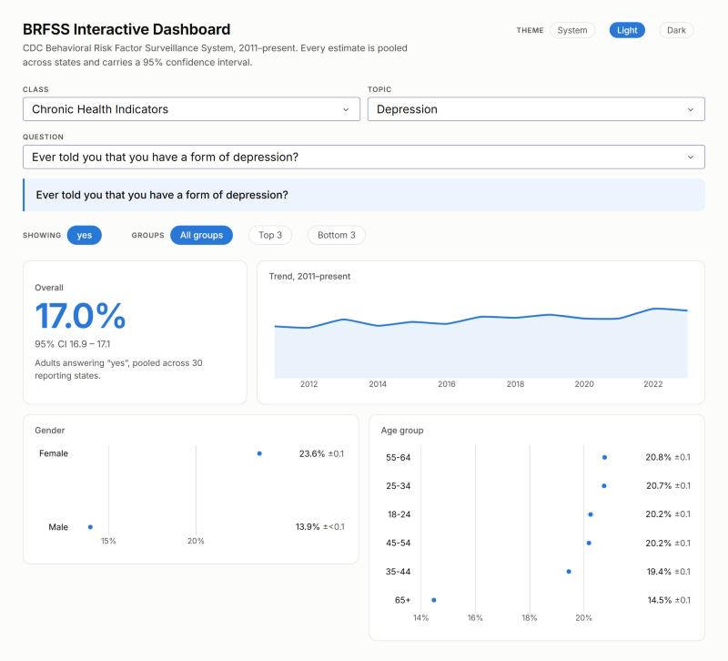

# BRFSS Interactive Dashboard (2011–present)

An interactive Plotly Dash app for exploring the CDC's **Behavioral Risk Factor Surveillance System**
(BRFSS) prevalence data. Pick any survey question, then see how responses break down by gender, age,
race, education, income, year and state, with confidence intervals on every estimate.

**Live: [brfssdashanalysis.vercel.app](https://brfssdashanalysis.vercel.app/)**

<p align="center">
  <picture>
    <source media="(prefers-color-scheme: dark)" srcset="docs/dashboard-dark.png">
    
  </picture>
</p>
<p align="center"><sub>One question on one screen: the overall figure, its trend, and every group's value with its 95% margin. GitHub shows the dark version if your theme is dark.</sub></p>

## What it does

- **Question picker:** a three-level cascade of Class → Topic → Question (for example, Chronic Health Indicators → Depression). Questions run to 117 characters, so the picker gets a row of its own and the selected question is repeated in full underneath, where it can wrap. Half of them end in the same parenthetical — `(variable calculated from one or more BRFSS questions)` — which is shown once as a note rather than on every label.
- **One screen per question:** an overall figure, a year-by-year trend, breakdowns by gender, age, race, education and income, and a state map — all visible together, no tab-hopping.
- **One response at a time:** pick which answer to read. Most questions are yes/no, where drawing both at once spends four-fifths of the ink on the complement of what you asked.
- **Confidence intervals you can read:** every group's value is printed with its 95% margin — `20.8% ±0.1` — in a column beside the panel. The margin is the reliable reading: these intervals are narrow (the median margin is ±0.16 points), so drawn to scale most of them are smaller than the dot marking the estimate. The interval is still drawn through each dot, and on a desktop-width panel about half of them are wide enough to show past it — usually the smaller groups, which is where the uncertainty matters. Margins under 0.05 print as `±<0.1` rather than a misleading `±0.0`.
- **Sorted, labelled groups:** groups are ordered by size and their values line up in that column, so each panel reads as a ranked table without counting gridlines.
- **Top / bottom 3:** narrow any breakdown to its three highest or lowest groups.
- **Light and dark themes:** follows the operating system by default, live, and remembers an explicit Light or Dark choice. Dark is its own validated palette rather than an inversion: the series blue steps up to the slot that holds contrast on a dark surface, and the map's colour ramp flips so low values recede into the background the same way they do in light mode.

## How the numbers are computed

BRFSS publishes a prevalence percentage and a sample size per state, year and breakout group, not raw
responses. To pool states into one estimate, each panel:

1. Drops the national rows (`US`, `UW`) so states aren't double-counted.
2. Rebuilds each row's denominator from `Sample_Size × 100 / Data_value`.
3. Pools respondents and denominators across states, so `percent = Σ respondents / Σ denominators`.
4. Computes `SE = √(p(100 − p) / n)` and plots `p ± 2·SE`.

First, `utils/merges.py` maps older and alternative response and breakout codes onto one set (for
example, income brackets refined over the years), so a group means the same thing in every year.

## Run it

The repo ships with everything the dashboard needs, so a clone runs as-is:

```bash
python -m pip install -r requirements.txt
python app.py
```

Open [http://127.0.0.1:8050](http://127.0.0.1:8050). Startup is instant: the app reads
`data/panels.json` (0.68 MB of pre-computed results) and nothing else. It does not import
pandas, numpy or pyarrow at all.

### Rebuilding the data

`data/panels.json` is generated. You only need to regenerate it if you change the
statistics or the CDC publishes a new year.

```bash
python -m pip install -r requirements-dev.txt
python -m pipeline.build --verify
```

That reads `data/brfss_raw.parquet` (21 MB, committed), applies the merges, pools the
states and writes `data/panels.json`. `--verify` re-runs the original per-question code in
`utils/` over every question and asserts the two agree, so the fast path can't silently
drift from the reference implementation.

To start from a fresh CDC download instead:

```bash
python -m pipeline.build --from-csv path/to/BRFSS_prevalence.csv --verify
```

The [CDC prevalence CSV](https://data.cdc.gov/api/views/dttw-5yxu/rows.csv?accessType=DOWNLOAD)
is about 1 GB; `--from-csv` converts it to the raw parquet first. Raw CSVs are git-ignored.

## Deploying

The dashboard runs on Vercel as a single Python serverless function, deployed from
`main` at [brfssdashanalysis.vercel.app](https://brfssdashanalysis.vercel.app/).
Pushing to `main` redeploys it.

```bash
vercel deploy
```

`api/index.py` exposes the Dash app's underlying Flask server, which is the WSGI callable
Vercel's Python runtime looks for, and `vercel.json` rewrites every path to it. The
pre-aggregation is what makes this viable: with only `dash` and `plotly` in
`requirements.txt` the bundle stays far inside Vercel's 250 MB function limit, and a cold
start loads a sub-megabyte JSON file instead of a 1 GB survey file.

`.vercelignore` keeps the parquet files, the pipeline and the coursework out of the
deployment.

## Structure

| Path | What it does |
|---|---|
| `app.py` | Layout, the question cascade, one callback per panel, and the per-theme chart palette |
| `assets/style.css` | Light and dark design tokens, card grid and responsive breakpoints |
| `assets/theme.js` | Tells Dash when the OS switches light/dark, so the System setting tracks it live |
| `api/index.py` | Vercel entry point — exposes the Flask server |
| `vercel.json` | Function config and catch-all rewrite |
| `pipeline/build.py` | Normalises the survey file and pre-computes every panel |
| `data/brfss_raw.parquet` | The CDC file as parquet, 21 MB (committed) |
| `data/panels.json` | Pre-aggregated results the app actually reads, 0.68 MB |
| `utils/merges.py` | Harmonises response and breakout IDs across years |
| `utils/prepare.py` · `utils/options.py` · `utils/aggregation.py` | The original per-question implementation, now the reference `--verify` checks the pipeline against |
| `BRFSS_Dashboard_Workflow_Notebook.ipynb` | Design rationale and workflow |
| `BRFSS_Dashboard_Slides.pptx` | Presentation |

## Stack

Python · Plotly Dash (runtime) · pandas · NumPy · PyArrow (build) · Vercel
